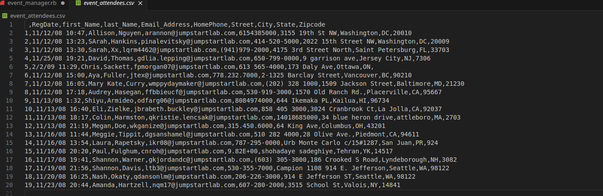

# Event_manager

* A program that keeps track of candidates data from another file (csv) to another using ruby

* And accesses Google's civic information API for providing persons' gorvenment representatives for elections and where they can vote etc.

## Development Process

1. Create directory `event_manager` with all neccesarry files
2. Fetch csv file to download it

> [!NOTE]
> This is how content is organised in a csv file
> </img>

### Reading contents of file

```
file_content = File.readlines(file_path) # stores content as line by line in array
puts file_content
```

### Reading a file line by line
```
file_content.each do |line|
puts line
end
```

## Challenges and Solutions

- [ ] How to use APIs
- [ ] How to access data from a Comma Seperated Value file
- [ ] Downloading external file from CLI
<br></br>
- [ ]
- [ ]
- [x] Install curl first with `sudo` package installer

## Discoveries

=> A csv file contains simple text that can be read my many applications and each data is seperated by a comma
<br></br>
=> The `readlines` method converts a file's lines as arrays items
